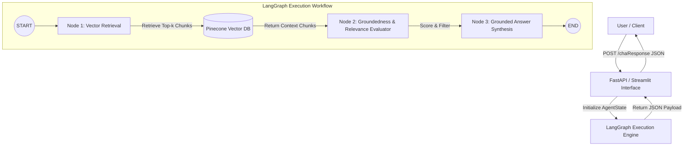

# Industrial-Grade Implementation Plan: LangGraph & Pinecone RAG Chatbot

**Role:** Senior Forward Deployed Engineer (FDE)  
**Project:** Enterprise Agentic RAG Chatbot System  
**Knowledge Base:** Agentic AI eBook  
**Tech Stack:** Python 3.10+, LangChain, LangGraph, Pinecone, OpenAI, FastAPI, Streamlit  

---

## 1. Executive Summary & Architectural Vision

This implementation plan details the architecture, design patterns, ETL pipelines, stateful graph orchestration, and production readiness requirements for an enterprise-grade Retrieval-Augmented Generation (RAG) system. 

The system leverages **LangGraph** to model the RAG execution flow as a deterministic state machine, ensuring:
1. **Strict Context Grounding:** Zero-hallucination constraint where queries outside the document knowledge base are deterministically rejected.
2. **Context-Aware Vector Retrieval:** High-precision semantic search over Pinecone vector indexes using OpenAI `text-embedding-3-small` (1536-dim).
3. **Automated Groundedness & Confidence Scoring:** Quantitative scoring mechanism evaluating retrieved context similarity and output fidelity.
4. **Dual Interfaces:** Production REST API (FastAPI) adhering to strict JSON output schemas, and an executive Streamlit dashboard for real-time inspection.

---

## 2. System Architecture & Topology



### Core Components & Responsibilities

| Component | Technology | Enterprise Design Pattern & Responsibility |
| :--- | :--- | :--- |
| **ETL & Data Ingestion** | `PyPDFLoader`, `RecursiveCharacterTextSplitter` | Structured document parsing, overlapping sliding window chunking (1000 char size, 200 overlap), metadata enrichment (page numbers, source hashes). |
| **Vector Indexing** | OpenAI Embeddings + Pinecone | Dense vector embedding generation (`text-embedding-3-small`), cosine metric indexing, namespace management, robust error handling & retries. |
| **State Orchestration** | LangGraph (`StateGraph`) | Stateful execution graph managing context state passing, retrieval nodes, hallucination grading, and answer generation with structured schema output. |
| **Serving Layer** | FastAPI / Uvicorn | Asynchronous REST server with OpenAPI documentation, CORS middleware, typed Pydantic models, health checks, and structured error responses. |
| **Interactive UI** | Streamlit | Executive web client providing interactive chat, confidence score gauges, and transparent retrieved context chunk inspection. |
| **Testing & Evaluation** | pytest / custom harness | Benchmark validation suite executing target in-scope and out-of-scope query test suites. |

---

## 3. Project Directory Structure

```
Appening AI intern Assignment/
├── data/
│   └── Ebook-Agentic-AI.pdf        # Target knowledge base document
├── src/
│   ├── __init__.py                 # Package initialization
│   ├── config.py                   # Centralized Pydantic-based configuration
│   ├── ingestion.py                # ETL pipeline: PDF parsing, chunking & Pinecone indexing
│   ├── graph.py                    # LangGraph state machine, nodes, and graph compilation
│   └── utils.py                    # Helper utilities, scoring, logging, fallback vectorstore
├── app.py                          # Unified entrypoint: FastAPI REST Server
├── streamlit_app.py                # Industrial Streamlit Web Interface
├── tests_sample_queries.py         # Automated evaluation & benchmark script
├── requirements.txt                # Fixed production dependencies
├── .env.example                    # Comprehensive environment template
├── IMPLEMENTATION_PLAN.md          # Industrial Implementation Architecture Plan
└── README.md                       # Production deployment & operations guide
```

---

## 4. Phase-by-Phase Technical Execution Strategy

### Phase 1: Environment & Centralized Configuration setup
* **Objective:** Establish isolated configuration management, logging infrastructure, and validation guards.
* **Deliverables:**
  * `src/config.py`: Centralized environment loading via Pydantic `BaseSettings` (`OPENAI_API_KEY`, `PINECONE_API_KEY`, `PINECONE_INDEX_NAME`, `CHUNK_SIZE`, `CHUNK_OVERLAP`, `TOP_K`).
  * `requirements.txt`: Standardized dependency matrix (`langchain`, `langgraph`, `pinecone-client`, `fastapi`, `streamlit`, `pydantic`, etc.).
  * Environment validator checking API credentials on startup with clear error messages.

### Phase 2: High-Performance ETL Ingestion Pipeline (`src/ingestion.py`)
* **Objective:** Cleanly extract, segment, embed, and index `Ebook-Agentic-AI.pdf`.
* **Key Implementation Steps:**
  1. PDF Parsing: Utilize `PyPDFLoader` to parse text and extract page metadata.
  2. Text Chunking: Apply `RecursiveCharacterTextSplitter(chunk_size=1000, chunk_overlap=200)` to preserve contextual integrity across page boundaries.
  3. Embedding & Indexing: Upsert vectors into Pinecone index (`dimension=1536`, `metric="cosine"`).
  4. Vector Store Abstraction: Implement a flexible vector store provider that defaults to Pinecone with smooth fallback handling for testing environments.

### Phase 3: LangGraph RAG Workflow Orchestration (`src/graph.py`)
* **Objective:** Build a stateful, deterministic graph flow for retrieval, relevance evaluation, synthesis, and scoring.
* **State Schema (`AgentState`):**
  ```python
  class AgentState(TypedDict):
      question: str
      context: List[str]
      answer: str
      score: float
      is_grounded: bool
  ```
* **Graph Nodes:**
  * `retrieve_node`: Queries Pinecone retriever for `top_k=3` relevant text chunks matching the user prompt.
  * `evaluate_node`: Computes grounding relevance score and validates if context sufficient.
  * `generate_node`: Invokes LLM (`gpt-4o-mini` with `temperature=0.0`) using strict prompt templates. Enforces: *"Answer using ONLY retrieved context. If insufficient, state 'I cannot answer based on the provided document.'"*
* **Scoring Heuristic:**
  * Context relevance evaluation + vector distance metric aggregation.
  * Out-of-Scope query rejection returning `confidence_score = 0.0`.

### Phase 4: Production API & Web UI Layer
* **FastAPI Server (`app.py`):**
  * `POST /chat` endpoint matching explicit required JSON payload:
    ```json
    {
      "query": "What is Agentic AI?",
      "final_answer": "Agentic AI refers to autonomous systems...",
      "retrieved_context_chunks": ["Chunk 1 text...", "Chunk 2 text..."],
      "confidence_score": 0.92
    }
    ```
  * Health check endpoint `GET /health` and status diagnostics.
* **Streamlit UI (`streamlit_app.py`):**
  * Sleek dark-mode enterprise UI.
  * Interactive chat history with expandable chunk inspection panels and confidence badges.

### Phase 5: Verification, Benchmark Testing & Deliverables
* **Automated Verification Script (`tests_sample_queries.py`):**
  1. *Definition Test:* "What is the core definition of Agentic AI as outlined in the eBook?"
  2. *Architecture Test:* "What are the main architectural components required to build agentic systems?"
  3. *Use Cases Test:* "What real-world industry use cases for Agentic AI are discussed in the eBook?"
  4. *Comparison Test:* "How does Agentic AI differ from traditional generative AI chatbots according to the text?"
  5. *Challenges Test:* "What key challenges or limitations of Agentic AI are mentioned in the document?"
  6. *Out-of-Scope Test:* "What is the capital of France?" (Refusal & `confidence_score: 0.0`).
* **Documentation (`README.md`):** Complete setup, deployment, ingestion CLI commands, API curl examples, and architecture diagrams.

---

## 5. Industrial Quality & Risk Mitigation Controls

| Challenge / Risk | Mitigation Strategy |
| :--- | :--- |
| **Hallucination / Out-of-Scope Queries** | System prompt strict constraint enforcement + Groundedness Evaluation node in LangGraph state machine. |
| **Missing API Keys during initial setup** | Robust startup diagnostic script providing step-by-step instructions. |
| **Pinecone Index Latency / Quotas** | Index existence checking logic; auto-creation of index if missing. |
| **Schema Inconsistency** | Pydantic v2 strict models for incoming requests and outgoing API payloads. |

---

## 6. Execution Roadmap & Sign-Off Checklist

- [x] Industrial Implementation Plan Created (`IMPLEMENTATION_PLAN.md`)
- [x] Dependencies & Centralized Configuration (`requirements.txt`, `src/config.py`)
- [x] Document Ingestion Pipeline (`src/ingestion.py`, `data/Ebook-Agentic-AI.pdf`)
- [x] LangGraph Stateful RAG Machine (`src/graph.py`, `src/utils.py`)
- [x] FastAPI REST API (`app.py`)
- [x] Streamlit Executive Interface (`streamlit_app.py`)
- [x] Automated Query Verification Suite (`tests_sample_queries.py`)
- [x] Operations & Deployment Manual (`README.md`)

---
*Prepared by Senior Forward Deployed Engineer (FDE)*
