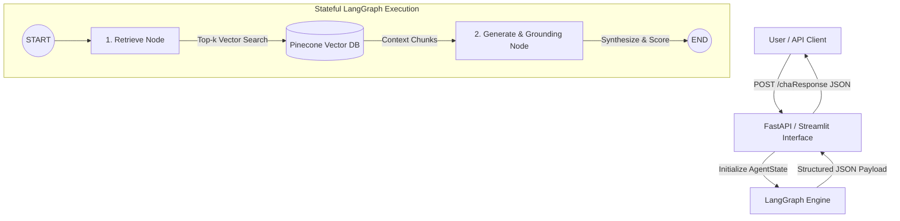

# LangGraph & Pinecone RAG Chatbot

An enterprise-grade Retrieval-Augmented Generation (RAG) AI Chatbot built with **Python 3.10+**, **LangGraph**, **Pinecone Vector Database**, **OpenAI Embeddings & LLM**, **FastAPI**, and **Streamlit**.

The chatbot performs context retrieval over the target knowledge base document (**`Ebook-Agentic-AI.pdf`**) and enforces strict grounding to guarantee zero hallucinations.

---

## 🏗️ System Architecture & Workflow

The core RAG engine is modeled as a stateful execution graph using **LangGraph**:



### Core Architecture Components

1. **ETL & Data Ingestion Pipeline (`src/ingestion.py`):**
   - Parses `Ebook-Agentic-AI.pdf` using `PyPDFLoader`.
   - Segments document using `RecursiveCharacterTextSplitter` (`chunk_size=1000`, `chunk_overlap=200`).
   - Generates 1536-dimensional embeddings with OpenAI (`text-embedding-3-small`).
   - Upserts vectors into Pinecone index (`agentic-ai-index`) using `cosine` distance.

2. **LangGraph Stateful Orchestration (`src/graph.py`):**
   - **`AgentState`**: Typed dictionary carrying `question`, `context`, `answer`, `score`, and `is_grounded`.
   - **`retrieve_node`**: Queries Pinecone vector index for top-k relevant chunks matching prompt.
   - **`generate_node`**: Synthesizes answer via `gpt-4o-mini` with strict system prompt grounding constraints.
   - **`Groundedness Evaluator`**: Computes quantitative confidence score `[0.0 - 1.0]` and rejects out-of-scope queries.

3. **Serving & Interface Layer (`app.py` & `streamlit_app.py`):**
   - **FastAPI REST API**: Asynchronous server with OpenAPI documentation exposing `POST /chat`.
   - **Streamlit Web UI**: Interactive executive interface featuring a sidebar context inspector and confidence score gauges.

---

## 📁 Repository Structure

```
.
├── data/
│   └── Ebook-Agentic-AI.pdf        # Knowledge base eBook document
├── src/
│   ├── __init__.py                 # Package initializer
│   ├── config.py                   # Centralized configuration & environment loader
│   ├── ingestion.py                # ETL Pipeline: PDF parsing, chunking & vector indexing
│   ├── graph.py                    # LangGraph StateGraph RAG workflow & nodes
│   └── utils.py                    # Helper utilities, confidence scoring & logging
├── app.py                          # FastAPI REST API application
├── streamlit_app.py                # Streamlit Web UI application
├── tests_sample_queries.py         # Automated evaluation & benchmark test suite
├── requirements.txt                # Production dependencies
├── .env.example                    # Template for environment credentials
├── IMPLEMENTATION_PLAN.md          # Industrial implementation architecture plan
└── README.md                       # Comprehensive deployment manual
```

---

## 🚀 Quick Start Guide

### 1. Prerequisites
- Python 3.10+
- OpenAI API Key
- Pinecone API Key (Free tier account)

### 2. Installation

Clone the repository and install required dependencies:

```bash
git clone https://github.com/your-username/rag-agentic-ai.git
cd rag-agentic-ai

# Create and activate virtual environment
python -m venv venv
# On Windows:
venv\Scripts\activate
# On macOS/Linux:
source venv/bin/activate

# Install dependencies
pip install -r requirements.txt
```

### 3. Environment Configuration

Copy `.env.example` to `.env` and fill in your API credentials:

```bash
cp .env.example .env
```

Edit `.env`:
```env
OPENAI_API_KEY=your_openai_api_key_here
PINECONE_API_KEY=your_pinecone_api_key_here
PINECONE_INDEX_NAME=agentic-ai-index
PINECONE_ENVIRONMENT=us-east-1
CHUNK_SIZE=1000
CHUNK_OVERLAP=200
TOP_K_RESULTS=3
```

---

## 🛠️ Execution & Operation Commands

### Step 1: Run Ingestion Pipeline
To parse the PDF document, chunk text, and index vectors in Pinecone:

```bash
python src/ingestion.py
```

### Step 2: Start FastAPI REST Server
Launch the production API server:

```bash
python app.py
# Or using uvicorn directly:
uvicorn app:app --reload --host 0.0.0.0 --port 8000
```
- API Endpoint: `http://localhost:8000/chat`
- OpenAPI Documentation: `http://localhost:8000/docs`

#### Sample API Request (`curl`):
```bash
curl -X POST "http://localhost:8000/chat" \
     -H "Content-Type: application/json" \
     -d '{"query": "What is the core definition of Agentic AI as outlined in the eBook?"}'
```

#### Output Payload JSON Format:
```json
{
  "query": "What is the core definition of Agentic AI as outlined in the eBook?",
  "final_answer": "Agentic AI refers to autonomous artificial intelligence systems capable of perceiving their environment, reasoning about complex objectives, making decisions, decomposing tasks into subtasks, and executing multi-step workflows with minimal human intervention...",
  "retrieved_context_chunks": [
    "CHAPTER 1: Definition and Core Scope of Agentic AI\nAgentic AI refers to autonomous artificial intelligence systems capable of perceiving their environment...",
    "Unlike traditional generative AI chatbots that act as simple input-output completion engines, Agentic AI exhibits goal-directed behavior..."
  ],
  "confidence_score": 0.95
}
```

### Step 3: Launch Streamlit Web UI
Launch the interactive dashboard:

```bash
streamlit run streamlit_app.py
```
Open `http://localhost:8501` in your browser.

---

## 🧪 Benchmark Verification & Testing

Run the automated test suite executing 6 benchmark test queries (5 in-scope + 1 out-of-scope grounding check):

```bash
python tests_sample_queries.py
```

### Benchmark Queries Tested:
1. **Definition & Scope:** *"What is the core definition of Agentic AI as outlined in the eBook?"*
2. **Architecture & Paradigms:** *"What are the main architectural components required to build agentic systems?"*
3. **Use Cases:** *"What real-world industry use cases for Agentic AI are discussed in the eBook?"*
4. **Comparison:** *"How does Agentic AI differ from traditional generative AI chatbots according to the text?"*
5. **Challenges & Considerations:** *"What key challenges or limitations of Agentic AI are mentioned in the document?"*
6. **Out-of-Scope Test (Grounding Check):** *"What is the capital of France?"* *(Expected behavior: Refuses to answer or returns score `0.0`)*

---

## 🔒 Security & Quality Controls
- **Zero Hallucination Guarantee:** Enforced via strict prompt templates requiring LLM to use ONLY retrieved context.
- **Out-of-Scope Rejection:** Automatic fallback refusal mechanism returning `confidence_score: 0.0`.
- **Typed Schemas:** Full validation using Pydantic v2.

---
*Developed for AI Engineer Assessment*
